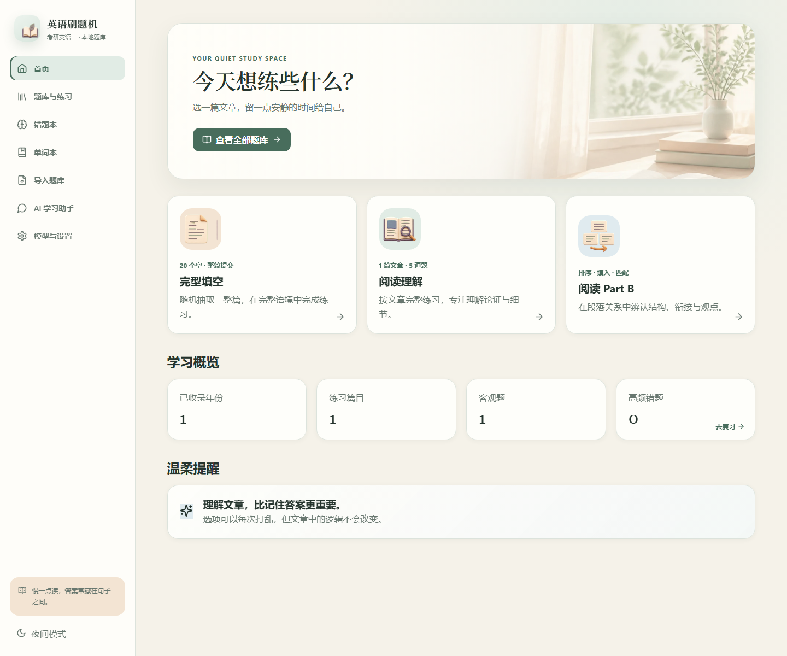
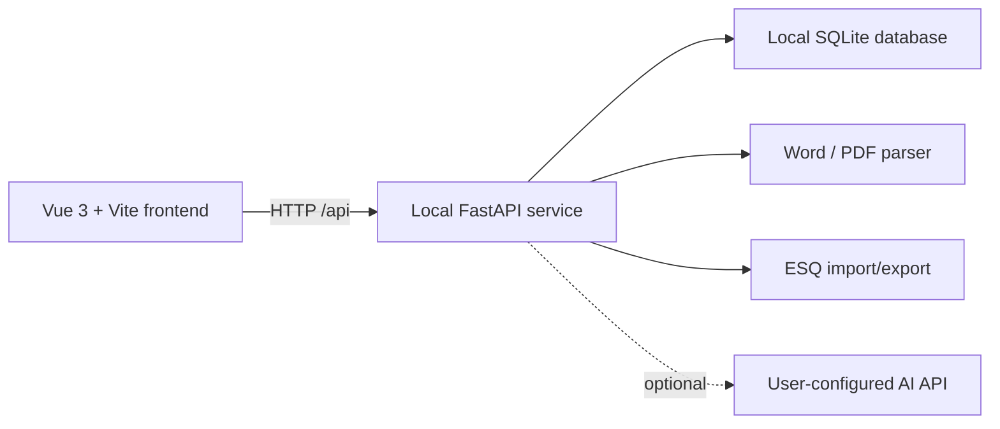

<div align="center">

  

  # English Practice Machine

  **Open question banks · Your models · Local data · Practice freely**

  A local Windows practice and review tool for English objective questions

  <p>
    <a href="README.md">简体中文</a>
    ·
    <a href="docs/question-bank-format.md">Question-bank format</a>
    ·
    <a href="LICENSE">GPL-3.0-only</a>
  </p>

  <p>
    
    
    
    
  </p>
</div>



*The README screenshot uses the project's self-built demo bank and contains no personal API, practice-history, or vocabulary database.*

## Make a limited question set feel fresh again

English Practice Machine is a Windows desktop app for learners who need sustained, high-volume practice with English objective questions (multiple-choice questions).

It is not a closed application with one fixed set of questions. Users can continuously import, organize, export, and share question banks. The current build supports the main objective-question formats used by Chinese postgraduate English I/II and CET-4/CET-6, while the open bank format can be extended to other English exams.

Users can connect a model through their own API endpoint. AI assistance can cover wrong-answer analysis, vocabulary translation and review, question-skill labeling, import-draft correction, and general English-learning questions. Complete API-profile and model-management controls let users choose between local and remote services instead of being tied to one provider.

The project follows a local-first approach: question banks, practice history, wrong answers, vocabulary, and model settings are stored in a local SQLite database by default. Basic practice and grading do not require an AI service.

### 📦 Open question banks

Import Word question banks or use ESQ packages to import, export, and share collections between users. Personal practice history, wrong answers, vocabulary, chats, and API profiles are excluded from shared packages.

### 🤖 AI-assisted learning

AI is used for more than chat. It can help analyze frequent mistakes, translate and review vocabulary, label question skills, detect structural issues in imported banks, and suggest draft corrections. It cannot silently rewrite the published question bank.

### 🔌 Complete model management

Store multiple API profiles, fetch available models, test connections, select defaults, enable or disable profiles, and control which models appear in the selector. Local Ollama, LM Studio, and other OpenAI-compatible services are supported.

### 🔁 Practice freely

Random practice selects complete units, options can be shuffled before each attempt, and wrong-answer redo keeps the full passage while asking only previously missed questions. Analysis focuses on error categories and review advice instead of translating or repeating the original questions.

> Even with a limited set of questions, every new attempt should require reading, reasoning, and answering again—not simply recalling the correct option.

The project is currently `v0.1.0-alpha / active development`. The main practice, wrong-answer, vocabulary, AI-assistant, model-assisted import, and ESQ sharing workflows are available. Portable releases, public CI, and additional exam templates are still being developed.

## Feature overview

| Area | Available now |
| --- | --- |
| Home | Learning overview, dark mode, vocabulary review every five seconds, frequent-word priority, quick random practice |
| Practice | Full-year papers, random complete units, postgraduate English I/II, CET listening/word bank/paragraph matching/reading |
| Submission | Unit submission, paper submission, unanswered-question navigation, score/correct/wrong feedback |
| Wrong answers | Year → unit navigation, redo/analysis, frequent mistakes, cached reports, and retry-gated re-analysis |
| Vocabulary | Right-click capture, translation after leaving practice, synonyms/antonyms/similar-form comparison |
| AI assistant | Multiple API profiles, multi-session chat, model sync, wrong-answer analysis, labels, and draft correction |
| Question bank | Multiple bank profiles, recycle bin, Word/PDF drafts, answer/audio attachments, ESQ 1.1, batch import |
| Data | Local storage, folder backup, Windows DPAPI encryption for API keys |

## Features in detail

### 1. Home and learning overview

- A quiet learning dashboard for recent practice, accumulated scores, and pending reviews.
- Dark mode for long reading sessions.
- The vocabulary review area shows a group of words at a time and flips to the next group **every five seconds**. Words seen at least twice are prioritized and marked with `🌟`.
- Quick actions start a random cloze, reading, or Part B unit.
- The AI learning assistant is placed above model/settings on the home page and occupies the right panel when opened. The practice page intentionally has no chat panel.

### 2. Practice modes

#### Practice by year

Select a year and complete its objective-question paper. Two submission modes are available:

- **Submit one unit** after finishing cloze, a reading passage, or Part B.
- **Submit the whole paper** after finishing the selected year.

If the selected scope contains unanswered questions, submission is blocked. The app highlights the missing question and navigates to the first unanswered item.

#### Random practice

Random mode selects a **complete unit**, never an isolated question:

- Cloze: one passage + 20 questions.
- Reading Part A: one passage + 5 questions.
- Part B: one material + 5 questions.

This keeps the context intact and makes a later attempt less dependent on remembering an answer choice or a previous option order.

#### Part B variants

The first release includes:

- Paragraph insertion
- Sentence insertion
- Paragraph ordering
- Title matching
- Information/viewpoint matching

Cloze and Part B blanks use structured markers. The renderer aligns the number and underline as a single blank so the target position remains easy to find.

#### Postgraduate English II and CET formats

- Postgraduate English II supports T/F-style Part B questions while retaining complete-unit practice and stable-key grading.
- CET-4/CET-6 support listening, word-bank cloze, paragraph matching, and detailed reading. Word-bank tasks use a passage plus a draggable A–O bank; paragraph matching uses a letter selector beside each statement.
- Listening transcripts are never shown and listening questions are excluded from wrong-answer analysis. Audio plays as one continuous track and is submitted as one section.
- With the timer enabled, seeking is locked; without the timer, the learner may seek freely. Exiting an unfinished listening section warns that the attempt will not be retained.

#### Practice experience

- Choose whether to shuffle options before starting.
- Display order may change, while stable internal option keys keep grading correct.
- Answers are saved automatically so a refreshed page can resume the active session.
- Optional timer. “Take a break” pauses the timer; continuing resumes it.
- After unit submission, the app shows the unit score and wrong-answer count. Whole-paper submission additionally shows the paper score and per-unit results.

### 3. Wrong-answer book and analysis

Wrong answers are grouped as **year → unit**, so different passages from the same year remain distinguishable. Each year and unit row has its own actions:

- Redo wrong questions for the year or for one unit.
- Analyze wrong questions for the year or for one unit.

Redo keeps the complete passage but asks only the questions previously answered incorrectly. Correct questions are hidden to preserve context without forcing unnecessary repetition.

Every answer selection is retained, with more weight assigned to recent attempts. Questions with `wrong_count >= 3` are automatically treated as frequent mistakes; users can also mark or unmark them manually.

Analysis follows a “do not translate the exam again” philosophy:

- The model receives the question, the selected wrong option, the correct answer, and structured skill metadata.
- The user sees counts and ratios for error categories plus actionable review advice.
- Question numbers and long translations of the original stem/options are not shown, reducing memory contamination before the next attempt.
- If evidence is insufficient, the result stays uncertain instead of forcing a vocabulary/grammar/context diagnosis.

Question labels can be generated in advance for skills, vocabulary demand, context dependency, traps, and attention points. Human-edited or locked labels are protected from later batch tasks.

Analysis reports are cached locally. Re-analysis for the same unit is blocked until the learner completes another wrong-question retry; the next analysis then receives the previous wrong-choice snapshot for trend comparison.

### 4. Vocabulary book

Right-click a selected word or a phrase of up to five words in a passage, stem, or option to add it to the vocabulary book.

The important behavior is **no translation at capture time**:

1. Save the word, original sentence, source year, unit, and occurrence record immediately.
2. Queue all pending words only when the learner leaves the practice page. Unit and paper submission do not start translation early.
3. Route changes, page hiding, and application backgrounding trigger reliable queueing; unfinished queued jobs recover on the next launch.
4. Show `queued`, `translating`, `ready`, or `failed` translation states.

The vocabulary book provides:

- Ordinary Chinese meaning as the primary display.
- Context meaning beside “Seen in the original”, rather than replacing the ordinary meaning.
- Cumulative occurrence count; two or more captures automatically receive the `🌟` frequent-word marker.
- Manual priority flag, search, filters, edit, delete, and retry translation.
- “Today’s review” states: Don’t know / Somewhat familiar / Mastered.
- Global display controls for synonyms, antonyms, and similarly spelled words. Similar forms prefer local vocabulary-book matching, while the model adds only natural relationships.
- Completed or manually edited meanings are never silently overwritten by automatic translation.

### 5. AI learning assistant and model settings

The AI assistant is optional. All core practice and grading flows remain usable without it.

Model-management features:

- Store multiple API profiles.
- Configure a name, endpoint, API key, default model, and maximum output tokens.
- Configure Temperature; the UI recommends lower values for grading, labeling, and structured imports, and larger output budgets for long-document review.
- Enable/disable profiles and decide whether each model appears in the selector.
- Automatically fetch available models; Ollama-compatible services have an `/api/tags` fallback.
- Test connectivity and switch models inside a chat.
- Create, switch, and delete multiple conversation sessions.

OpenAI-compatible services can be used, including local Ollama, LM Studio, and other services exposing a compatible `/v1` API. Exact capabilities depend on the configured provider and model.

AI-assisted workflows include:

- Study questions and review-plan discussions.
- Batch translation for vocabulary entries.
- Frequent-wrong-answer analysis with category ratios and review advice.
- Pre-labeling question skills and traps.
- Answer verification, question-number remapping, and optional stem/option ownership correction for Word/PDF drafts.

Safety boundaries:

- The model cannot directly edit the published question bank. Import corrections and label suggestions require user confirmation.
- API keys are encrypted with Windows DPAPI before being stored in the local database.
- Only content explicitly submitted by the user is sent to the selected remote model: chat messages, vocabulary context, wrong-answer material, or draft-question text. Choose a provider according to its retention and privacy policy.

### 6. Question-bank profiles, recycle bin, and batch management

- Create separate bank profiles for different exams and switch the active profile from Home, Library, or Import.
- The same profile may contain multiple papers for the same year; every import explicitly targets one profile.
- Long-press a paper to enter multi-select mode, then move selected papers to another profile or the recycle bin.
- Deleted papers, non-empty profiles, and unfinished import drafts remain in one recycle bin for seven days and can be restored or permanently removed.
- Wrong answers follow the active bank profile. Vocabulary remains shared across profiles, with recently added entries prioritized.

### 7. Word / PDF question-bank import

The “Import question bank” page accepts `.docx`, `.doc`, and text-based `.pdf` papers:

1. Select the target bank profile, paper, one or more answer attachments, and optional listening audio (MP3/M4A/WAV/OGG).
2. Build a local draft and optionally run full-model verification for question boundaries, answer mapping, and question-number alignment.
3. Edit metadata, passages, stems, options, answer sources, and Part B candidates in a field-by-field visual reviewer.
4. Publish only after validation, then optionally start AI labeling for the newly imported paper. Listening questions are excluded from labeling.

If model assistance fails, the local draft remains available for manual review or retry with another model. The model edits only the draft; publishing still requires explicit approval. Legacy `.doc` conversion uses Microsoft Word COM on the local machine, so `.docx` is recommended.

When the paper has no embedded key, upload DOC/DOCX/PDF answer attachments. If no answer can be extracted, save the questions first and enter answers manually. Scanned or heavily watermarked PDFs without a reliable text layer are rejected with an OCR/manual-processing message.

The public importer accepts one paper per import. A confirmation dialog appears before processing; if one file contains multiple complete papers, only the first draft is generated and later papers are ignored to prevent cross-paper misalignment.

For large local collections, use the resumable batch tool:

```powershell
.\.venv\Scripts\python.exe .\tools\batch_import.py --help
```

It supports discovery, answer/audio pairing, full-model verification, retry with backoff, resume state, and content-hash deduplication. Validate a small sample before a large run.

### 8. ESQ 1.1 sharing format

`.esq` is a shareable question-bank package made of a ZIP archive and UTF-8 JSON. It is designed to move a bank between users without relying on local SQLite IDs.

Format highlights:

- One package may contain multiple years.
- ESQ 1.1 adds exam type, month, set number, and listening-track metadata while remaining backward-compatible with ESQ 1.0.
- Stable `packageId`, `paperKey`, `unitKey`, and `questionKey`.
- Standard answers included by default.
- Optional AI labels.
- Paragraphs, quotes, tables, images, audio, separators, and `{{blank:n}}` cloze markers.
- Preview before import; choose “keep local” or “replace with imported version” on conflicts.
- Replacement attempts to preserve internal `question_id`, practice history, and wrong-answer statistics.
- AI labels are imported only when the content hash matches; human-edited or locked labels are preserved.

Share packages do not contain:

- Practice and timer history
- Wrong-answer records
- Vocabulary book
- Chat history
- API profiles or API keys

Read the format documentation, schema, example package, and validator:

- [Question-bank format](docs/question-bank-format.md)
- [ESQ 1.0 JSON Schema](docs/schemas/esq-1.0.schema.json)
- [Demo package](examples/demo-bank.esq)
- [CLI validator](tools/validate_question_bank.py)

Validate a custom package:

```powershell
.\.venv\Scripts\python.exe .\tools\validate_question_bank.py .\your-bank.esq
```

## Quick start

### Verified environment

- Windows 10/11
- Python 3.12.13
- Node.js 24.x
- pnpm 11.x

Other versions may work, but they are not currently part of the public compatibility matrix.

### Run from source

Open PowerShell in the project root:

```powershell
py -3.12 -m venv .venv
.\.venv\Scripts\python.exe -m pip install -r requirements.txt

cd frontend
corepack pnpm install --frozen-lockfile
corepack pnpm run build
cd ..

.\.venv\Scripts\python.exe run_app.py
```

The app listens on `http://127.0.0.1:8765` and attempts to open the browser automatically.

The included PowerShell scripts provide the same setup and launch flow:

```powershell
.\setup.ps1
.\start.ps1
```

Development mode uses two terminals:

```powershell
# Terminal 1: backend
.\.venv\Scripts\python.exe -m uvicorn backend.app.main:app --host 127.0.0.1 --port 8765 --reload
```

```powershell
# Terminal 2: frontend
cd frontend
corepack pnpm run dev
```

Open `http://127.0.0.1:5173` for the development UI. Vite proxies `/api` to the local backend. FastAPI OpenAPI docs are available at `http://127.0.0.1:8765/docs`.

## Typical workflow

1. Start the app and review the vocabulary group on the home page.
2. Choose a full-year paper or start a random complete unit.
3. Decide whether to shuffle options and enable the timer.
4. Read the passage and answer every question; pause with “Take a break” when needed.
5. Submit the unit or paper and review the score, correct count, and wrong count.
6. Open the wrong-answer book to redo or analyze a year/unit.
7. Apply the review advice and return to the same passage later.
8. Right-click unfamiliar words in passages, stems, or options and review their meanings later in the vocabulary book.

## Data, privacy, and backup

Default data layout:

```text
backend/data/
├── question_bank.db       # SQLite bank, practice, wrong answers, vocabulary, model profiles
├── uploads/               # Imported Word/PDF files
└── question_banks/        # ESQ packages and media
```

- The service listens on `127.0.0.1` by default and has no account system.
- Basic practice, grading, and local review require no network connection.
- The project does not currently include analytics, telemetry, or Sentry-style reporting.
- When AI is enabled, submitted text leaves the computer; provider retention, billing, and privacy policies apply.
- Close the app before backing up, then copy the entire `backend/data` directory.
- Never commit the database, uploaded question banks, API keys, or personal records to GitHub; these paths are ignored by `.gitignore`.

## Tech stack and architecture

- Frontend: Vue 3, TypeScript, Vite, Vue Router, Lucide Vue, Auto Animate.
- Backend: Python, FastAPI, Uvicorn, SQLite.
- Document parsing: `python-docx`, `lxml`, `pypdf`.
- Secure storage: `cryptography` for Windows DPAPI encryption.



Repository layout:

```text
backend/
  app/
    routers/       # practice, wrong answers, vocabulary, AI, imports, banks
    services/      # parsing, grading, translation, labels, ESQ
    data/          # local runtime data (ignored)
frontend/
  src/
    views/         # home, practice, wrong answers, vocabulary, settings
docs/              # question-bank format and schema
examples/          # shareable package examples
tools/             # validators and resumable batch importer
tests/             # backend and format tests
```

## Tests and quality checks

Run locally:

```powershell
.\.venv\Scripts\python.exe -m unittest discover -s tests -v
```

```powershell
cd frontend
corepack pnpm run build
```

The latest local check recorded 76 backend tests passing, one private full-corpus test skipped by environment, and a successful production frontend build. Full-corpus integration tests are explicitly enabled through the `ENGLISH_PRACTICE_CORPUS` environment variable and skip automatically when a private corpus is unavailable. GitHub Actions CI is still being prepared.

## Status and roadmap

Core workflows already available:

- Local Windows practice and grading
- Complete-unit random practice
- Wrong-answer book, redo, and structured analysis
- Vocabulary translation after leaving practice, including word-relation comparisons
- Multiple API profiles and model-catalog synchronization
- Multiple bank profiles, one recycle bin, and batch paper management
- Visual Word/PDF draft review, model-assisted import, and resumable batch import
- Postgraduate English II, CET objective formats, and ESQ 1.1 sharing
- GPL-3.0-only code license and author metadata

Before the first public release, the maintainer should:

- Add GitHub Actions CI with recurring secret and privacy-file scans.
- Add `CONTRIBUTING.md`, `SECURITY.md`, and issue/PR templates.
- Publish a Windows `v0.1.0-alpha` portable build.

## Contributing question banks and code

Code, parser fixes, UI improvements, and legally shareable ESQ packages are welcome. A question-bank contribution should state:

- Source and curation method
- Package license
- Whether it includes answers, media, or AI labels
- Whether redistribution is allowed

Code contributions follow GPL-3.0-only. Question-bank content does not automatically inherit the code license; use the `license` and `source` declarations in each ESQ `manifest.json`.

## Author and license

Author and maintainer: **往事随风k**

The program code is released under the [GNU General Public License v3.0 only](LICENSE). See [AUTHORS.md](AUTHORS.md) and [NOTICE.md](NOTICE.md) for authorship and third-party notices.

Question banks, question text, answers, AI labels, and ESQ packages may have independent sources and permissions. Confirm that you have the necessary rights before using or sharing a package.
