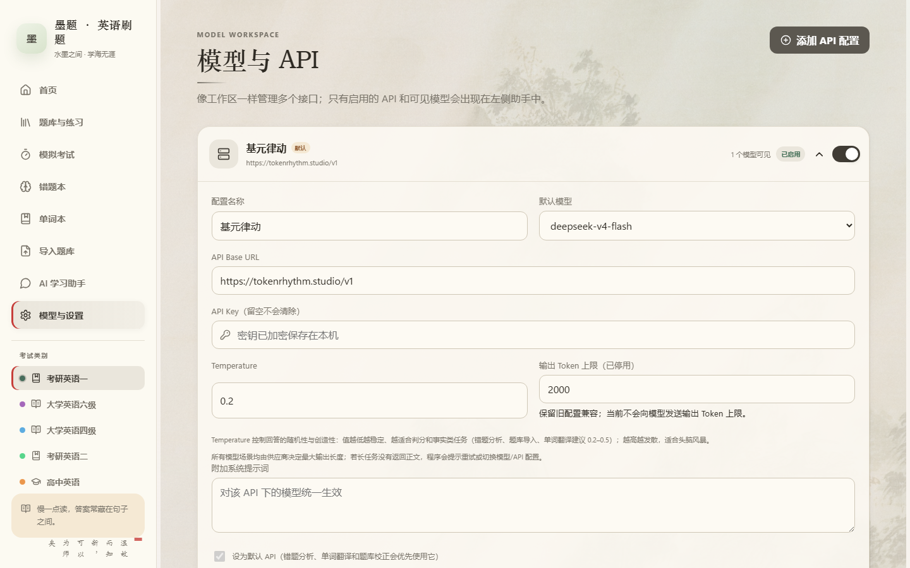
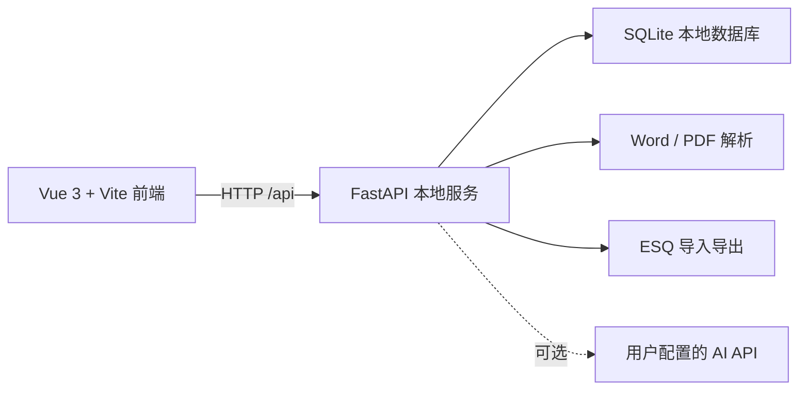

<div align="center">

  

  # 英语刷题机

  **题库自由 · 模型自由 · 数据本地 · 自由刷题**

  **英语刷题机（English Practice Machine）是开源的英语客观题刷题与复习工具，为考研/四六级/高考考生提供本地优先的真题练习、错题迭代、单词记忆与 AI 学习辅助——不依赖网络、不绑定服务商、数据完全自持。**

  <p>
    <a href="README.en.md">English</a>
    ·
    <a href="docs/question-bank-format.md">题库格式</a>
    ·
    <a href="LICENSE">GPL-3.0-only</a>
    ·
    <a href="https://github.com/mo9652962-ai/english-multiple-choice-practice-machine/actions/workflows/ci.yml">GitHub Actions CI</a>
  </p>

  <p>
    
    
    
    
  </p>
</div>


*README 截图使用项目自建演示题库，不包含个人 API、做题记录或单词本数据库。*

## 让有限的题目，也能反复刷出新鲜感

英语刷题机（English Practice Machine）是一款面向有长期、大量英语客观题（选择题）练习需求的学习者的 Windows 本地应用。

它不是一套内容固定、无法扩展的封闭题库，而是一套可以由使用者持续导入、整理和分享题库的英语学习工具。项目目前支持考研英语（一/二）以及大学英语四、六级的主要客观题型，并可通过开放的题库格式扩展到其他英语考试。

使用者可以通过 API 接口接入自己选择的大模型，让模型辅助完成错题分析、单词翻译与记忆、题库考点标注、导入草稿校正和英语学习问答。完整的 API 配置与模型管理功能，让使用者可以自由选择本地模型或远程模型，而不被绑定到某一家服务。

项目采用 local-first 设计：题库、做题记录、错题本、单词本和模型配置默认保存在本机 SQLite 数据库中；基础刷题和判分不依赖大模型。


*信息图中的词汇卡片为展示用画面，不是随仓库分发的单词本数据。*

### 📦 自由题库

支持自行导入 Word 题库，也支持通过 ESQ 格式导入、导出和分享题库。不同使用者可以互相交换题库，而个人练习记录、错题、单词本、聊天记录和 API 配置不会写入分享包。

### 🤖 大模型辅助学习

大模型不仅用于普通聊天，还可以辅助分析高频错题、翻译和记忆单词、标注题目考点、发现题库结构问题并提出导入校正建议。模型不能直接改写正式题库，需要用户确认的修改不会被静默执行。

### 🔌 完整的模型配置管理

支持保存多个 API 配置、自动拉取可用模型、测试连接、设置默认模型、启用或停用 API，以及控制模型是否出现在选择器中。兼容本地 Ollama、LM Studio 和其他 OpenAI-compatible API 服务。

### 🔁 自由刷题

随机练习始终抽取完整篇目；选项可以在每次练习前重新打乱；错题重做保留文章语境，但只要求回答曾经做错的题；错题分析只给出错误类型和复习建议，尽可能避免通过翻译或复述原题强化答案记忆。

> 我们希望即使题目数量有限，每一次重新练习仍然需要理解文章、判断逻辑和重新作答，而不是把反复刷题变成机械地背答案。

项目当前处于 `v2.0.0-beta.15 / 持续开发阶段`。核心刷题、错题本、单词本、AI 助手、模型辅助导入、ESQ 题库分享链路、移动端竖屏适配、安全存储加密、学习热力图与打卡海报已经可以使用；便携发布包和更多考试模板仍在完善中。公开 GitHub Actions CI 已覆盖前端类型检查/构建、后端单元测试和后端导入检查。

**当前内置数据**：692 道客观真题（含 2026 高考英语全国 I 卷 45 题）+ **7,751 个全类别核心词汇**（高考 2,702 / 四级 1,989 / 六级 2,232 / 考研 828——含音标与真题/双语例句）。

## 功能概览

| 模块 | 当前能力 |
| --- | --- |
| 主页 | 学习概览、暗色模式、每 5 秒翻页的词汇回顾、高频词优先、快速开始随机练习、**推荐卷按年去重 + 卷别标签**、**动态题型入口（无听力不显示听力卡）** |
| 练习 | 按年份整卷、随机抽整篇、**选项打乱（防记答案）**、**桌面快捷键（Anki 习惯——1/2/3/4 选答案）**、考研英语一/二、四六级听力/选词填空（**点空选题 v3.6**）/段落匹配/阅读 |
| 提交 | 整篇提交、整卷提交、未答题定位、得分/正确数/错题数反馈 |
| 错题本 | 按年份 → 篇目组织、重做/分析、**迭代递减（重做只显示本次错的，越做越少）**、高频错题统计 |
| 单词本 | 文章/题干/选项右键收藏、退出练习后批量翻译、同义/反义/形近词辨析、高频 🌟、**7,751 词内置词库（音标+真题/双语例句）**、**听写模式（TTS 发音→拼写 / 听音 4 选 1）**、**短文填词（真题句挖空）**、**分级背诵计划（FSRS 间隔重复）**、**学习三态（认识/模糊/忘记）**、**词书计划本地生成（百词斩式 4 词书）**、**AI 文章练词 + 划词生词本** |
| AI 助手 | 多 API 配置、多会话、模型同步、聊天、错题分析、题库标注和导入草稿校正 |
| 口语 | **口语练习（VAD 切句 + 浏览器 Whisper 全离线转写，音频不出设备）**、在线识别回退、逐句反馈 |
| 作文 | **考研大小作文 · 阅卷组标准多维批改**、逐句批注、满分范文对照、历史批改记录 |
| 听力 | **MP3/M4A/WAV/OGG 音频导入、内置播放器、计时时禁拖进度条** |
| 题库 | 多题库配置、回收站、Word/PDF 草稿、答案/音频附件、ESQ 1.1、批量导入、**2025-2026 最新真题** |
| 数据 | 本地存储、可复制备份、API Key 使用 Windows DPAPI / Android Keystore AES-GCM 加密 |
| 移动端 | **竖屏上下分区（文章/题目独立滚动 + 可拖分隔条）**、**底部导航合并（笔记=错题+单词）**、**答题卡抽屉（题目导航）**、**动态首页** |
| 激励 | **14 枚成就徽章**（连续打卡/词汇量里程碑/刷题成就）、连续学习天数统计、**学习热力图（GitHub 贡献图风格——90 天统计）**、**打卡海报（百词斩式水墨分享图——WebShare 分享）**、**报告页词汇记忆曲线（墨墨式遗忘曲线 SVG）** |
| 更新 | **前端自动更新检测（60s 轮询）**、GitHub Release + HTTPS 镜像双源、SHA-256 校验 |

## 界面展示

| | |
|:---|:---|
|  |  |
| 学习主页 · 词汇回顾 · 备考倒计时 | 推荐卷 · 按年去重 · 卷别标签 |
|  |  |
| 真题练习 · 选项打乱 · 计时 | 多题库 · 年份/卷别筛选 |
|  |  |
| 四级词库 · 音标 · 双语例句 | 高考词库 · 真题例句 |
|  |  |
| 考研词库 · 分级背诵计划 | 模型配置 · 数据备份 · 安全存储 |

## 详细功能

### 1. 主页与学习概览

- 用简洁的学习面板查看最近练习、累计得分和待复习内容。
- 支持深色模式，适合长时间阅读。
- 单词回顾区每次展示一组单词，**每 5 秒上下翻页**；重复加入两次及以上的词会优先展示，并以 `🌟` 标记高频词。
- 可从主页快速进入随机完形、随机阅读或随机 Part B 练习。
- AI 学习助手位于主页的模型与设置上方，点击后独占右侧面板；做题页面不放置聊天窗口，避免分散注意力。

### 2. 练习模式

#### 按年份刷题

选择某一年后，可以完成该年份的整套客观题。提交方式有两种：

- **单篇提交**：做完完形、某篇阅读或 Part B 后单独判分，适合分段学习。
- **整卷提交**：完成该年份全部题目后统一判分并查看整卷成绩。

如果目标范围内有未答题，程序不会提交，而是提醒缺题并跳转到第一道未完成的题。

#### 随机刷题

随机模式按**完整篇目**抽取，而不是把文章拆成孤立小题：

- 完形填空：一篇文章 + 20 道题。
- 阅读 Part A：一篇文章 + 5 道题。
- Part B：一篇材料 + 5 道题。

这样既能保留上下文，也不会因为只记住某一道题的选项顺序而失去训练价值。

#### Part B 题型

第一版纳入以下 Part B 变体：

- 段落插入（paragraph insertion）
- 句子插入（sentence insertion）
- 段落排序（paragraph ordering）
- 小标题匹配（title matching）
- 信息/观点匹配（information or viewpoint matching）

完形和 Part B 中需要填写的位置使用结构化空位标记，渲染时会将下划线与数字正确对齐，避免“数字悬在下划线中间”或空位难以定位。

#### 英语二与四六级题型

- 考研英语（二）支持 T/F 判断式 Part B，并继续使用完整篇目练习和稳定选项键判分。
- 四六级支持听力、选词填空、长篇段落匹配和仔细阅读。选词填空使用文章内可点击空白——**v3.6 起点击空白直接弹出选项（替代原 A—O 可拖拽词库，解决右侧面板点击无响应问题）**，已选答案回填到文中空白处；段落匹配使用陈述旁的字母选择器。
- 听力原文不显示，也不进入错题分析；音频按整轨播放、整段提交。启用计时器时不能拖动进度，未计时时可以自由定位。
- 未完成听力练习直接退出时会明确提示本次记录不会保留。

#### 做题体验

- 可在开始前选择是否打乱选项。
- 选项显示顺序可以改变，但系统使用稳定的内部选项键判分，不会因打乱而误判。
- 答案会自动保存，刷新页面后可以继续当前练习。
- 可选计时；练习过程中点击“休息一下”会暂停计时，继续练习后恢复。
- 提交后立即显示本篇得分、本篇错题数；整卷提交后额外显示整卷得分和各篇成绩。

### 3. 错题本与错题分析

错题本按“年份 → 具体篇目”组织，避免把同一年不同文章混在一起。年份和篇目右侧分别提供操作按钮：

- 开始重做该年份的错题，或只重做某篇错题。
- 开始分析该年份的错题，或只分析某篇错题。

重做错题时保留完整文章，但只要求回答过去做错的题；做对的题不重复显示，既保持语境，也减少无效重复。

系统会保留每次选择记录，并给近期记录更高权重。默认将 `wrong_count >= 3` 的题标记为高频错题，也支持手动标记/取消标记。

错题分析遵循“尽量不翻译原题”的刷题理念：

- 模型收到题号、题目、用户错误选项、标准答案及结构化考点信息。
- 输出错误类型的数量和比例，以及可执行的复习建议。
- 不向用户展示题号，也不大段翻译题目和选项，降低再次刷题时的记忆干扰。
- 当证据不足时保留“不确定”，不会强行把错误归因于词汇、语法或逻辑中的某一种。

题库还可以先批量标注考点、词汇需求、上下文依赖、常见陷阱和注意事项。人工编辑或锁定后的标签不会被后续批量任务覆盖。

分析结果会缓存在本机。同一篇错题在完成下一次重做前只展示已有报告，不会重复消耗模型；完成重做后才允许重新分析，并把上一次错误选项快照提供给模型进行趋势比较。

### 4. 单词本

在文章、题干或选项中，用鼠标右键选中一个单词或不超过 5 个词的短语即可加入单词本。

设计原则是**加入时不显示翻译**：

1. 加入时立即保存单词、真题原句、出处年份、篇目和出现次数。
2. 只有离开答题界面时才把全部待处理单词加入批量翻译队列，单篇/整卷提交不会提前触发。
3. 路由离开、页面隐藏或应用切换会触发可靠入队；下次启动会恢复已入队但未完成的任务。
4. 单词本显示 `queued`、`translating`、`ready`、`failed` 等翻译状态。

单词本当前支持：

- 普通中文释义优先展示。
- 语境释义放在“真题中的遇见”旁边，用于说明该词在原句中的含义。
- 同一词重复加入会累计“遇见次数”；达到两次及以上自动显示 `🌟` 高频标记。
- 支持人工标记重点、搜索、筛选、编辑、删除和重试翻译。
- “今日复习”提供“不认识 / 有点印象 / 已掌握”三档状态。
- 可按全局显示设置展开同义词、反义词和形近词辨析；形近词优先使用本地单词本匹配，模型只补充自然存在的关系。
- 已完成或人工编辑的释义不会被自动翻译覆盖。

### 5. AI 学习助手与模型设置

AI 助手是可选增强功能，不启用模型也可以完成全部基础刷题流程。

支持的模型管理能力：

- 保存多个 API 配置。
- 为配置设置名称、接口地址、API Key、默认模型和最大输出 Token。
- 可调整 Temperature；界面会提示低温度更适合判分、标注和结构化导入，高输出 Token 更适合长文档校对。
- 启用/停用某个配置，控制某个模型是否显示在模型选择器中。
- 自动拉取可用模型；对 Ollama 兼容服务支持 `/api/tags` 回退。
- 测试 API 连接，并在聊天窗口内切换模型。
- 保存多个对话，支持新建、切换和删除会话。

支持的 OpenAI-compatible 服务包括本地 Ollama、LM Studio，以及其他提供兼容 `/v1` 接口的服务。具体模型能力取决于用户配置的服务。

AI 可用于：

- 学习问答和复习计划讨论。
- 单词本批量翻译。
- 高频错题的错误类型统计与复习建议。
- 预先批量标注题库考点。
- 为 Word/PDF 导入草稿核对答案、修正题号映射，并在用户开启高风险开关时修正题干和选项归属。

安全边界：

- 模型不能直接修改正式题库；导入校正和标签建议必须由用户确认后才写入。
- API Key 使用 Windows DPAPI（Windows）/ Android Keystore AES-GCM（Android）加密后存入本地数据库。
- 只有在用户主动调用相应功能时，聊天内容、词汇语境、错题材料或题库草稿才会发送到所选远程模型；请根据服务商政策选择模型。

### 6. 题库配置、回收站与批量管理

- 可以为不同考试创建独立题库配置，并从主页、题库页和导入页切换当前配置。
- 同一配置允许存在同一年份的多套试卷；导入前必须选择目标配置。
- 题库页长按试卷进入多选模式，可批量移动到其他配置或移入回收站。
- 删除试卷、非空题库配置和未完成导入草稿后会进入统一回收站，保留 7 天；期间可以恢复或立即彻底删除。
- 错题本跟随当前题库配置筛选；单词本跨题库共享，并优先展示最近加入的词。

### 7. Word / PDF 题库导入

“导入题库”页面支持 `.docx`、`.doc` 和文本型 `.pdf` 试卷：

1. 选择目标题库配置、试卷文件、一个或多个答案附件，以及可选听力音频（MP3/M4A/WAV/OGG）。
2. 本地解析后生成草稿；默认可调用所选模型全量核对题目定位、答案对应和题号映射。
3. 在逐字段可视化校对器中编辑试卷信息、篇章、题干、选项、答案来源和 Part B 候选项。
4. 校验通过后发布到正式题库，再选择是否立即对本次试卷执行智能标注；听力题不会发送给标注模型。

模型辅助失败时保留本地草稿，并允许人工审查或切换其他模型重试。模型只修改草稿，正式题库仍必须由用户批准入库；旧式 `.doc` 转换依赖本机 Microsoft Word COM，建议优先使用 `.docx`。

如果文档不含答案，可以上传 DOC/DOCX/PDF 答案附件；仍未识别到答案时可以先保存题目并逐题人工录入。扫描版或水印严重且缺少可靠文字层的 PDF 会明确提示先 OCR 或人工处理。

当前公开导入器一次只导入一套题目。点击开始导入前会弹窗提醒；同一文档包含多套真题时只生成第 1 套草稿，其余套次忽略，避免未知文档的跨套错位。

需要处理大量文档时，可以使用可恢复批量工具：

```powershell
.\.venv\Scripts\python.exe .\tools\batch_import.py --help
```

批量工具支持文件发现、答案/音频匹配、模型全量校对、失败重试、断点续跑和内容哈希去重。请先在少量样本上确认解析质量。

### 8. ESQ 1.1 题库分享格式

`.esq` 是“ZIP + UTF-8 JSON”的可分享题库包，目标是让题库可以脱离本机 SQLite ID，在不同用户之间稳定交换。

格式特性：

- 一个包可包含多个年份。
- ESQ 1.1 增加考试类型、月份、套次和听力轨道元数据，同时保持对 ESQ 1.0 的向后兼容。
- 使用稳定的 `packageId`、`paperKey`、`unitKey`、`questionKey`。
- 标准答案默认随包提供。
- 可选携带 AI 标签。
- 支持段落、引用、表格、图片、音频、分隔线。
- 完形空位使用 `{{blank:n}}` 结构化标记。
- 导入前预览，冲突时由用户选择“保留本地”或“使用导入版本替换”。
- 替换时尽量保留内部 `question_id`、练习记录和错题统计。
- 只有内容哈希匹配的 AI 标签才会导入，人工编辑或锁定标签不会被覆盖。

分享包不会包含以下个人数据：

- 做题记录与计时记录
- 错题本
- 单词本
- AI 聊天记录
- API 配置和 API Key

格式文档、JSON Schema、示例包和校验器：

- [题库格式说明](docs/question-bank-format.md)
- [ESQ 1.0 JSON Schema](docs/schemas/esq-1.0.schema.json)
- [示例题库包](examples/demo-bank.esq)
- [命令行校验器](tools/validate_question_bank.py)

验证自定义题库包：

```powershell
.\.venv\Scripts\python.exe .\tools\validate_question_bank.py .\你的题库.esq
```

## 快速开始

仓库现已内置两套可直接练习的起始题库：**考研英语一（2010-2026）**与
**考研英语二（2010-2025）**。首次启动时程序会自动校验并安装这两套 ESQ
题库，用户无需再手动导入；之后启动会按题库包 ID 与内容版本自动跳过，
不会重复创建试卷或覆盖个人练习数据。可在主页或题库页面随时切换题库配置，
也可以继续导入其他 ESQ、Word 或 PDF 题库。

内置题库是独立的内容包，不适用本仓库代码的 GPL-3.0-only 许可。题目来源、
使用说明与内容许可边界以各 ESQ 包内的 `manifest.json` 和声明文件为准。

### 已验证环境

- Windows 10/11
- Python 3.12.13
- Node.js 24.x
- pnpm 11.x

其他版本可能可用，但目前没有作为公开兼容矩阵验证。

### 从源码运行

在项目根目录打开 PowerShell：

```powershell
py -3.12 -m venv .venv
.\.venv\Scripts\python.exe -m pip install -r requirements.txt

cd frontend
corepack pnpm install --frozen-lockfile
corepack pnpm run build
cd ..

.\.venv\Scripts\python.exe run_app.py
```

程序会监听 `http://127.0.0.1:8765`，并尝试自动打开浏览器。也可以手动访问该地址。

也可以使用项目提供的 PowerShell 脚本完成同样的流程：

```powershell
.\setup.ps1
.\start.ps1
```

开发模式需要两个终端：

```powershell
# 终端一：后端
.\.venv\Scripts\python.exe -m uvicorn backend.app.main:app --host 127.0.0.1 --port 8765 --reload
```

```powershell
# 终端二：前端
cd frontend
corepack pnpm run dev
```

开发页面为 `http://127.0.0.1:5173`，`/api` 请求会代理到本地后端。后端 OpenAPI 文档位于 `http://127.0.0.1:8765/docs`。

## 常用使用流程

1. 启动程序，在主页查看今日词汇和学习概览。
2. 选择“按年份”完成整卷，或从主页随机抽取一整篇文章。
3. 开始前决定是否打乱选项、是否启用计时。
4. 阅读文章后完成全部题目；需要休息时点击“休息一下”。
5. 单篇或整卷提交，查看得分、正确数和错题数。
6. 在错题本按年份/篇目重做或分析。
7. 阅读复习建议，回到同一篇文章再次训练。
8. 遇到生词时右键加入单词本，稍后在单词本查看普通释义和语境释义。

## 数据、隐私与备份

默认数据目录：

```text
backend/data/
├── question_bank.db       # SQLite 题库、练习、错题、单词本、模型配置
├── uploads/                # Word/PDF 导入文件
└── question_banks/         # ESQ 包及其媒体资源
```

- 服务默认只监听 `127.0.0.1`，不提供账户系统。
- 基础刷题、判分和本地复习不需要联网。
- 项目当前未设计 analytics、telemetry 或 Sentry 等遥测功能。
- 启用 AI 后，主动提交给模型的文本会离开本机；模型服务商的留存、计费和隐私政策由用户自行承担。
- 备份前关闭程序，然后复制整个 `backend/data` 目录。
- 不要把数据库、上传题库、API Key 或个人练习记录提交到 GitHub；这些路径已加入 `.gitignore`。

## 多人模式（可选）

默认是**本地单用户**模式（服务只监听 `127.0.0.1`）。若要在局域网/公网部署供多人使用，开启账户系统：

| 环境变量 | 说明 | 默认 |
|:---|:---|:---|
| `EPM_AUTH` | 设为 `1` 开启多用户登录（业务路由要求带 token；未开启时全部匿名兼容单用户） | 关闭 |
| `EPM_ADMIN_USERNAME` | **指定管理员用户名**（该用户名注册即自动成为管理员）。强烈建议部署时设置，防止「空库首注册抢注管理员」 | 未设置时首个注册用户自动成为管理员（旧逻辑） |
| `EPM_API_KEY` | 可选：API 层密钥（中间件校验，未配置时不生效） | 无 |
| `EPM_AI_DAILY_QUOTA` | 多人模式下每用户每日 AI 调用上限（chat+口语合并计数，防刷 key 成本）；`0` = 不限制 | `0` |

### 启用步骤

```bash
# 1. 启动后端前设置环境变量
export EPM_AUTH=1
export EPM_ADMIN_USERNAME=admin          # 用你的管理员用户名替换
export EPM_API_KEY=your-api-key          # 可选，建议开启

# 2. 首次启动后，用管理员用户名注册（该账号自动成为管理员）
# 3. 其他人注册普通账号，各自的数据（错题/练习/作文/口语/词汇/报告/成就）互相隔离
```

### 安全说明（v9.30）

- 所有用户数据表（错题、练习、AI 对话、作文、口语、词汇、诊断报告、标注、成就、学习报告）均按 `user_id` 隔离，跨用户访问返回 404。
- 登录接口带失败计数限流（同一 IP+用户名 15 分钟内失败 ≥5 次锁定 15 分钟）。
- `EPM_ADMIN_USERNAME` 未设置时的「首注册=管理员」仅为兼容旧逻辑，公网部署**务必显式指定**。
- 公网部署建议：HTTPS 反向代理 + 强密码 + 定期备份 `backend/data`。

## 技术栈与架构

- 前端：Vue 3、TypeScript、Vite、Vue Router、Lucide Vue、Auto Animate。
- 后端：Python、FastAPI、Uvicorn、SQLite。
- 文档解析：`python-docx`、`lxml`、`pypdf`。
- 安全存储：`cryptography` 提供 Windows DPAPI / Android Keystore AES-GCM 加密。



目录概览：

```text
backend/
  app/
    routers/       # 练习、错题、词汇、AI、导入和题库接口
    services/      # 解析、判分、翻译、标注和 ESQ 逻辑
    data/          # 本地运行数据（已忽略）
frontend/
  src/
    views/         # 主页、练习、错题本、单词本、设置等页面
docs/              # 题库格式与 Schema
examples/          # 可分享题库示例
tools/             # 题库校验与可恢复批量导入工具
tests/             # 后端与格式测试
```

## 测试与质量检查

本地可运行：

```powershell
.\.venv\Scripts\python.exe -m unittest discover -s tests -v
```

```powershell
cd frontend
corepack pnpm run build
```

当前最近一次完整后端测试为 76 项通过、1 项私人全题库测试按环境跳过，前端生产构建通过。公开 GitHub Actions CI 会安装 `requirements-dev.txt`，执行 `python -m pytest -q tests`、前端类型检查/构建和后端导入检查。完整真题库集成测试通过 `ENGLISH_PRACTICE_CORPUS` 显式启用，在没有私人题库的公开环境中会自动跳过。

## 当前状态与路线图

已完成的核心链路：

- Windows 本地刷题与判分
- 完整篇目随机练习
- 错题本、重做和结构化错题分析
- 退出练习后批量翻译、支持词义辨析的单词本
- 多 API 配置与模型目录同步
- 多题库配置、统一回收站与批量试卷管理
- Word/PDF 可视化草稿校对、模型辅助导入与批量导入工具
- 英语二、四六级客观题模板和 ESQ 1.1 分享格式
- 学习热力图、连续打卡统计、打卡海报、词汇记忆曲线
- 听写模式（TTS 拼写 / 听音 4 选 1）、词书计划、学习三态
- 水墨启动画面、桌面快捷键、AI 文章练词与划词生词本
- GPL-3.0-only 代码许可证与作者信息

开源发布前仍建议完成：

- 加入 GitHub Actions CI，并持续执行密钥和隐私文件扫描。
- 增加 `CONTRIBUTING.md`、`SECURITY.md`、Issue/PR 模板。
- 制作 Windows `v2.0.0` 便携版（对齐路线图：正式版含便携包）。

## 贡献题库与代码

欢迎提交代码、解析器修复、界面改进和合法可分享的 ESQ 题库包。提交题库时请同时说明：

- 来源与整理方式
- 题库包许可证
- 是否包含标准答案、媒体或 AI 标签
- 是否允许再分发

代码贡献遵循 GPL-3.0-only。题库内容不自动继承代码许可证，必须以 ESQ `manifest.json` 的 `license` 和 `source` 声明为准。

## 作者与许可证

作者与维护者：**sora（mo9652962-ai）**

程序代码以 [GNU General Public License v3.0 only](LICENSE) 发布。版权与第三方依赖说明见 [AUTHORS.md](AUTHORS.md) 和 [NOTICE.md](NOTICE.md)。

题库、题目文本、答案、AI 标签以及 ESQ 包可以有独立的来源和授权条件。使用或分享题库前，请确认自己拥有相应权利。

## 常见问题（FAQ）

**Q: 必须配置 AI 模型才能用吗？**
不用。基础刷题、判分、错题本、单词本完全离线可用；AI 助手、单词翻译、错题分析、题库导入校正是可选增强功能。

**Q: 和百词斩/墨墨/不背单词有什么不同？**
本工具聚焦"真题刷题 + 错题迭代 + 语境记忆"闭环：内置真题库可刷可练，错题重做只显示本次错题（迭代递减），词汇带真题/双语例句。不追求游戏化堆功能，专注应试提分。数据 100% 本地，不收集隐私。

**Q: 题库可以自己导入吗？**
可以。支持 Word/PDF 草稿导入、ESQ 1.0/1.1 格式导入导出分享、模型辅助定位题目与答案（需用户确认后入库）。

**Q: 支持哪些考试？**
内置考研英语一/二、大学英语四六级、高考英语真题题库，支持通过 ESQ 扩展到其他考试。

**Q: 数据存在哪？会不会丢？**
全部存在本机 SQLite（Windows: %APPDATA%\ai-english-practice-desktop）。有自动备份机制（data/backups/）。API Key 使用 Windows DPAPI / Android Keystore AES-GCM 加密。

## 路线图

- [x] v2.0.0-beta.12：竞品功能回收（听力/选项打乱/错题迭代/安全存储）
- [x] v2.0.0-beta.13：安全存储加密接线 + 2026 高考 I 卷
- [x] v2.0.0-beta.14：移动端 P0+P1（竖屏分区/动态首页/笔记合并/答题卡）+ 词汇库 7,751 词
- [x] v2.0.0-beta.15：竞品借鉴 2 轮——热力图/连续天数/打卡海报/学习三态/词书计划/水墨启动画面/听写选择题/桌面快捷键/记忆曲线/AI 文章练词
- [ ] v2.0.0-beta.16：词汇音标 + 双语例句全量 + 四六级真题补充
- [ ] 正式版 v2.0.0：公开 CI、便携版安装包、更多考试模板

## 相关链接

- [更新发布](https://github.com/mo9652962-ai/epm-releases/releases)
- [题库格式规范](docs/question-bank-format.md)
- [功能一图看懂](docs/images/feature-overview-public.webp)
- 反馈问题 / 建议 → [Issues](https://github.com/mo9652962-ai/epm-releases/issues)
